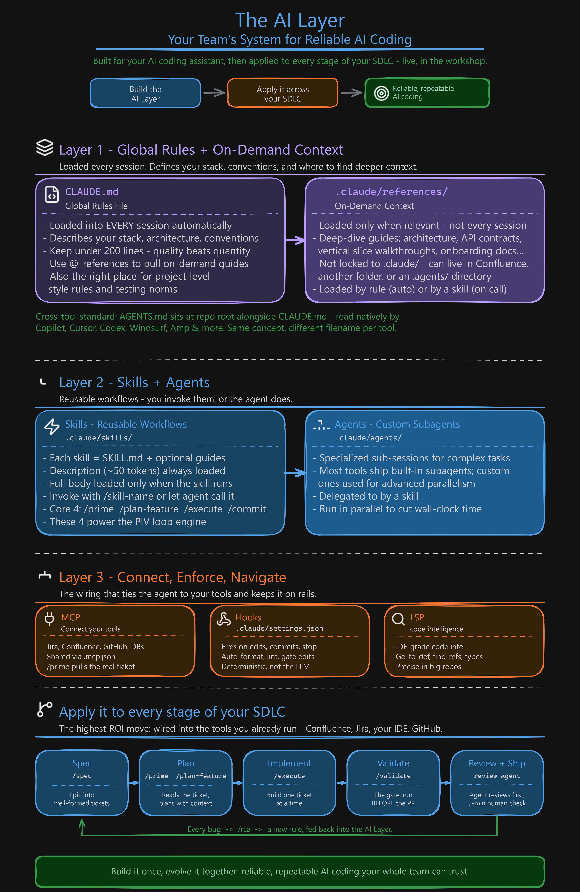
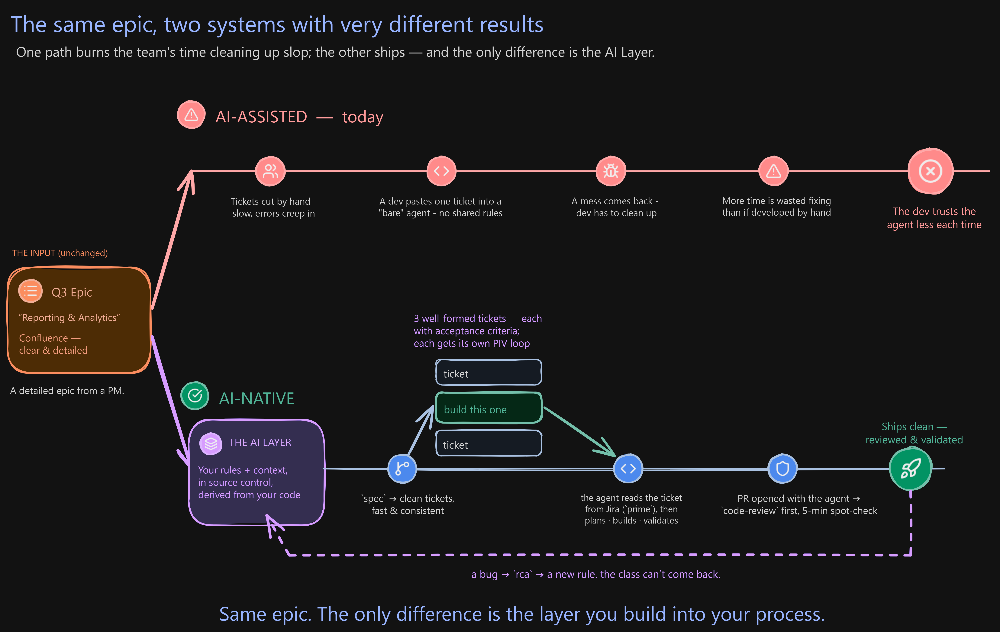

# AI Layer Starter Pack

O **AI Layer** reutilizável para engenharia agentic — as habilidades, agentes e documentos de referência que você instala **uma única vez** em qualquer base de código. Esta é a fundação genérica usada no workshop gratuito *“AI-Native Engineering Org”*: você instala este pacote e, depois, **deriva o restante a partir do seu próprio código**, integrando-o ao processo da sua equipe.

> **Instale uma vez → personalize a partir da sua base de código.**  
> O pacote é intencionalmente genérico. A parte específica da sua base de código no AI Layer — suas regras em `CLAUDE.md` e os módulos sob demanda em `.claude/context/` — é gerada com a skill **`/create-rules`** abaixo, lendo o seu código real. Essa é a ideia central: o AI Layer é o conhecimento e o processo da sua equipe, codificados.

## Instalação

```bash
# 1. Clone este pacote
git clone https://github.com/coleam00/ai-native-starter-pack

# 2. Copie o AI Layer para o seu projeto
#    (skills/agents/references + o .mcp.json da Atlassian)
cp -r ai-native-starter-pack/.claude <seu-repo>/.claude
cp ai-native-starter-pack/.mcp.json <seu-repo>/.mcp.json

# 2a. Opcional: ative os dois hooks básicos
#     (proteção contra arquivos .env / rm -rf + trilha de auditoria).
#     Faça commit do settings.json resultante para que toda a equipe herde essa garantia.
cp ai-native-starter-pack/.claude/settings.json.example <seu-repo>/.claude/settings.json

# 2b. Opcional: workflow de revisão de PR
#     (requer um secret CLAUDE_CODE_OAUTH_TOKEN no repositório)
cp -r ai-native-starter-pack/.github <seu-repo>/.github

# 3. No seu repositório, derive suas regras a partir do seu código real:
#    execute /create-rules → gera CLAUDE.md + .claude/context/
#    com referências ao seu código

# 4. Conecte contexto externo:
#    o pacote inclui um .mcp.json para o Atlassian MCP (Jira + Confluence).
#    Edite/substitua conforme a sua stack e depois execute:
#    /prime <jira-keys> <confluence-page-ids>
```

Também é possível usar Git submodule caso você queira acompanhar atualizações do repositório original.

## O que está incluído

**Contexto e priming**
- `prime` — carrega o contexto da base de código; opcionalmente, busca issues do Jira e páginas do Confluence primeiro (`prime [jira-keys] [confluence-page-ids]`, via Atlassian MCP)
- `prime-backend` / `prime-frontend` — priming focado em um dos lados de um repositório full-stack

**Construção da camada, específica da base de código**
- `create-rules` — **deriva `CLAUDE.md` + `.claude/context/` a partir da sua base de código real** (Brownfield Type A). Deve ser a primeira skill executada por projeto.
- `create-prd` — para projetos greenfield: transforma uma ideia em um PRD

**O loop PIV**  
Plan → Implement → Validate — a metodologia central

- `plan-feature` — **P**lanejar: cria um plano de implementação rico em contexto, em uma única passada
- `execute` — **I**mplementar: constrói estritamente a partir do plano aprovado
- `validate` — **V**alidar: executa testes, type-check, lint e build do projeto antes de abrir um PR
- `commit` — cria um commit estruturado ao final de um ciclo

**Revisão**
- `code-review` (+ o agente `code-reviewer`) — primeira revisão de um diff/PR
- `code-review-fix` — aplica as correções indicadas na revisão

**Evolução do sistema**  
Melhora o AI Layer ao longo do tempo.

- `rca` — faz análise de causa raiz de um bug *e* propõe uma regra + teste de regressão para evitar que o problema se repita
- `system-review` — compara intenção vs. resultado; identifica regras/contextos que precisam ser ajustados
- `execution-report` — registra o que um ciclo realmente executou em comparação com o plano

**Fatiamento e paralelismo**
- `spec` — divide um épico/PRD em tickets de tamanho adequado para o loop PIV, com grafo de dependências
- `new-worktrees` / `merge-worktrees` — executa tickets independentes em paralelo usando git worktrees

**Exemplos e extras**
- `end-to-end-feature`, `implement-fix`, `ast-grep`, `init-project` — skills reutilizáveis adicionais

**Agentes:** `code-reviewer`, `system-reviewer`, `research-agent`  
**Referências universais de boas práticas:** `architecture-patterns`, `backend-api-best-practices`, `frontend-component-best-practices`, `vertical-slice-architecture`  
**Integração MCP:** `.mcp.json` — já vem apontando para o **Atlassian MCP** (Jira + Confluence), permitindo que `prime` busque tickets e páginas de especificação vinculadas por padrão. Edite para apontar para a sua própria stack.  
**Hooks:** `.claude/hooks/` — dois guardrails genéricos e sempre ativos: bloqueio de leitura de segredos reais e `rm -rf`, além de registro de todas as chamadas de ferramentas. Inclui `settings.json.example` para ativá-los. Veja `.claude/hooks/README.md` para qualquer item específico do seu fluxo de trabalho, como uma etapa de conclusão ou transferência de artefatos entre skills — esses itens precisam ser descritos ao seu agente, não simplesmente copiados de um pacote genérico.

## Diagramas do workshop

Os mapas da sessão ao vivo estão disponíveis para reutilização gratuita.

### O AI Layer em uma visão geral

O que realmente compõe a camada: regras globais e contexto sob demanda, skills e agentes, além das conexões — MCP, hooks e LSP — que ligam o agente às ferramentas que você já usa.



### O mesmo épico, dois sistemas

Todo o workshop em um único quadro. O mesmo épico no Confluence seguindo dois caminhos: em um deles, a equipe desperdiça tempo limpando “slop”; no outro, a equipe entrega. A única diferença é o AI Layer.



### O mesmo épico, dois sistemas

Todo o workshop em um único quadro. O mesmo épico no Confluence seguindo dois caminhos: em um deles, a equipe desperdiça tempo limpando “slop”; no outro, a equipe entrega. A única diferença é o AI Layer.


## Relação com o curso Dynamous Agentic Coding

Este é um **subconjunto focado** para o workshop de 2 horas — suficiente para construir o AI Layer e executar o loop PIV + evolução do sistema de ponta a ponta. O curso completo **Dynamous Agentic Coding** se aprofunda muito mais, cobrindo vários outros módulos, comandos, subagentes e os fluxos completos de validação, codificação remota, MCP e Archon. Este pacote é o ponto de entrada.

## Licença / uso

Uso gratuito. Criado para participantes do workshop *“AI-Native Engineering Org Transformation”*, mas você não precisa ter participado. Clone, instale e adapte para a sua realidade.
